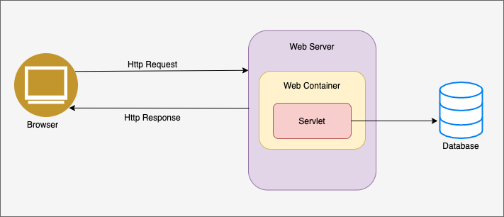

# Servlet


## Servlet(서블릿) 이란?

```basic
동적 웹 페이지를 만들 때 사용되는 자바 기반의 웹 애플리케이션 프로그래밍 기술

웹 요청과 응답의 흐름을 간단한 메서드 호출만으로 체계적으로 다룰 수 있게 해준다.
```



예를 들면, 로그인시 서버가 클라이언트에서 입력되는 아이디와 비밀번호를 확인하고 결과를 응답하는 역할을 서블릿이 수행한다.

### 특징

- 클라이언트의 요청에 동적으로 작동한다.
- JAVA의 스레드를 이용해 동작한다.
- MVC 패턴에서 컨트롤러로 이용된다.
- 보안기능 적용이 쉽다.
- 컨테이너에서 실행된다.

## Servlet의 동작 과정


서블릿은 위 사진과같이 동작한다.

- HTTP 요청
- Web Application Server가 Request, Response 객체를 새로 만들어 서블릿 객체를 호출
- 서블릿 객체가 Request에서 HTTP 요청 정보를 꺼내 비즈니스 로직을 수행
- 다시 Response 객체에 HTTP 응답 정보를 담음
- Web Application Server가 Response 객체에 담긴 내용으로 HTTP 응답 정보를 생성하여 클라이언트로 전송

즉, 서블릿은 웹 애플리케이션에서 HTTP 프로토콜을 이용해 요청을 처리하고 응답하는 자바 클래스

아래는 서블릿을 구현한 코드 예시입니다.

```java
@WebServlet(name = "TestServlet", urlPatterns = "/test")
public class TestServlet extends HttpServlet {

    @Override
    protected void service(HttpServletRequest request, HttpServletResponse response) {
        // application logic
    }
}
```

## 서블릿의 생명 주기

```basic
서블릿이 실행된 후 초기화, 서비스 수행, 소멸하기까지의 과정

각 단계마다 호출되어 기능을 수행하는 콜백 메서드를 생명주기 메서드라고 한다.
```

### 서블릿 생명주기 메서드

- 초기화 : init()
    - 서블릿 요청시 맨 처음 한번만 호출되며, 초기화 작업을 수행한다.
- 작업 수행 : doGet(), doPost()
    - 서블릿 요청시 매 번 호출되며, 클라이언트가 요청하는 작업을 수행한다.
- 종료 : destroy()
    - 서블릿이 기능을 수행 후 메모리에서 소멸될 때 호출되며, 마무리 작업을 수행한다.

## Servlet Container

```basic
구현되어 있는 servlet 클래스의 규칙에 맞게 서블릿을 담고 관리해주는 컨테이너

여러 서블릿 객체를 효과적으로 관리하기 위해서 만들어졌다.
```


톰캣처럼 서블릿을 지원하는 Web Application Server를 서블릿 컨테이너라고 한다.

서블릿 컨테이너는 서블릿 객체를 생성, 초기화, 호출, 종료하는 생명주기를 관리하는 역할을 하고 여러 서블릿 객체를 싱글톤으로 관리합니다. 또한, 동시 요청을 위한 멀티 쓰레드 처리도 지원한다.

## JSP(Java Server Page)

```basic
HTML 코드에 JAVA 코드를 넣어 동적웹페이지를 생성하는 웹어플리케이션 도구

JSP 실행시 자바 서블릿으로 변환되며 웹 어플리케이션 서버에서 동작되어 필요한 기능을 수행한다.
```

## Servlet vs JSP

|  | Servlet | JSP |
| --- | --- | --- |
| 정의 및 구조 | 순수 JAVA 코드로만 이루어진 웹서버용 클래스 <br> 동적 웹페이를 만들 때 java 코드 안에 HTML 태그가 삽입되는 구조 | HTML 코드 속에 자바 코드가 들어가는 구조의 스크립트 언어 |
| 코드 내 처리방법 | 자바 코드 속에서 HTML 태그로 문자열 ("")로 처리해야  한다.| HTML 속에서 자바코드를 <% 소스코드 %> 또는 <%= 소스코드 =%> 형태로 처리한다.<br>(자바 소스코드로 작성된 부분은 웹 브라우저로 보내는 것이 아니라 웹 서버에서 실행된다) |
| 한계(Servlet)와 보완(JSP) | 1. 화면 인터페이스 구현에 너무 많은 코드를 필요로 하여 비효율적이다.<br>2. 테스트할 때 빌드를 항상 다시해야 한다는 한계가 있다.<br>3. HTML 변경 시 Servlet을 재컴파일해야 한다. | -> 이에 따라 서블릿 기반의 서버사이트 스크립트 언어 JSP가 등장함<br>1. HTML 표준에 따라 작성되므로 웹페이지 작성이 편리해짐<br>2. WAS에서 자동으로 빌드하고 클라이언트 화면에 동적으로 보여준다. |
| MVC 패턴에서의 역할 | Controller | View |