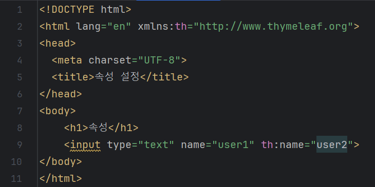
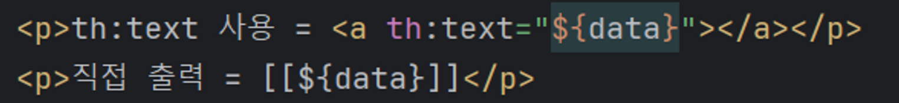
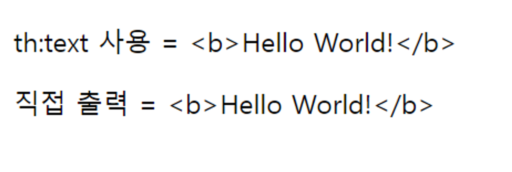
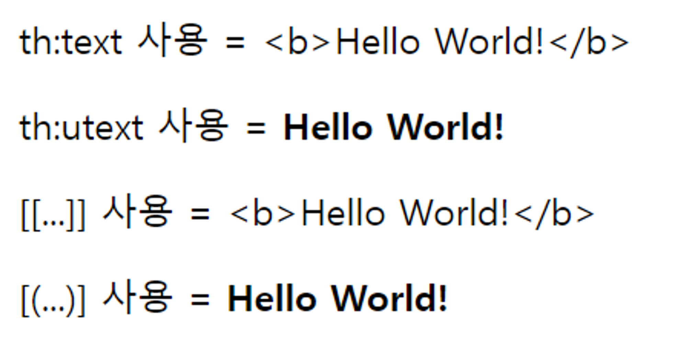
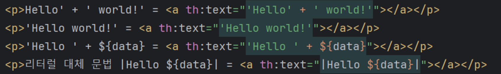

# Thymeleaf

# Thymeleaf 란?

- JSP, Freemarker와 같은 **템플릿 엔진**의 일종

## 특징

- **서버 사이드 HTML 렌더링 (SSR)**
    
    백엔드에서 **HTML을 동적으로 렌더링 하는 용도**로 사용한다.
    

- **Natural Template**
    
    타임리프는 **순수 HTML을 유지**하는 특징을 가진다.
    
    **파일을 직접 열어도 확인**할 수 있고, 뷰 템플릿으로 **동적으로 변경된 결과도 확인**할 수 있다.
    
- **Spring 통합 지원**
    
    스프링과 통합되어있어서, **스프링의 다양한 기능을 편리하게 사용**할 수 있다.
    또한, Spring 에서 **공식적으로 타임리프 사용을 권장**하고있다.
    

# 기본 기능

## 태그 속성

- 타임리프는 주로, **HTML 태그에 th:* 속성을 지정하는 방식**으로 동작한다.



- 위 사진처럼 th:* 속성을 지정하면, 기존 속성인 HTML의 **`name=”user1”`**이 아닌 **`th:name=”user2”`** 로 속성을 대체한다.

## 텍스트 출력

- 데이터를 출력할 때는, **`th:text=”${…}”`** 를 사용한다.
HTML 태그의 속성이 아니라 HTML 콘텐츠 안에서 직접 데이터를 출력할 때는 **`[[…]]`**를 사용한다.
    
    
    

- HTML 문서는 <, > 같은 특수 문자를 기반으로 정의된다.
< 를 태그의 시작이 아닌 **문자로 표현**하는 것을 **HTML 엔티티**라고 하고,
**특수문자를 HTML 엔티티로 변경**하는 것을 **이스케이프 ( `Escape` )** 라고 한다.
    
    
    
- 그러나 위와 같이 <b> 태그를 활용해 문자에 Bold 효과를 넣으려고 할 때, **Escape에 의해 원치 않은 결과를 얻게 된다.**
    
    
    
- 이럴 땐, **타임리프가 제공하는 Unescape를 사용**하면 다음과 같이 원하는 결과를 얻을 수 있다.
- **`th:utext, [(…)]`**
    
    ![[], ()가 출력되지 않아, &#91, &#93, &#40, &#41을 대신 사용했습니다.](img/Thymeleaf/9eb3f4ec-0320-4879-8ee1-11f86373987d.png)
    
    [], ()가 출력되지 않아, &#91, &#93, &#40, &#41을 대신 사용했습니다.
    
    
    

## Spring EL 변수 표현식

- 타임리프에서 **변수를 표현**할 때는 **`${…}`** 의 변수 표현식을 사용한다.
이 안에 **들어가는 변수 종류에 따라서 표현 방법**도 다르다.

- **Object**
    
    ```java
    **- user.username      : user의 username 프로퍼티에 접근
    - user[’username’]   : 위와 같음.
    - user.getUsername() : user의 getter 메서드 직접 호출**
    ```
    

- **List**
    
    ```java
    **- users[0].username      : List 에서 첫 번째 회원을 찾고, username 프로퍼티에 접근
    - users[0].[’username’]  : 위와 같음
    - users[0].getUsername() : List 에서 첫 번째 회원을 찾고, user의 getter 메서드 직접 호출**
    ```
    

- **Map**
    
    ```java
    **- userMap['user1'].username      : Map에서 user1를 찾고, username 프로퍼티 접근
    - userMap['user1']['username']   : 위와 같음
    - userMap['user1'].getUsername() : Map에서 user1를 찾고 user의 getter 메서드 직접 호출**
    ```
    

- **지역변수 선언**
    
    ```java
    **th:with 를 사용하면 지역변수를 선언에서 사용할 수 있다.
    단, 지역변수는 선언한 태그 안에서만 사용이 가능하다**
    ```
    

## 기본 객체와 편의 객체

- 타임리프는 아래와 같은 **기본 객체를 제공**한다.
    
    ```java
    **- ${#request}
    - ${#response} 
    - ${#session} 
    - ${#servletContext} 
    - ${#locale}**
    ```
    
- 그러나, **`#request`** 는 **`HTTPServletRequest 객체`** 가 그대로 제공되어 **조회가 불편**하다.

- 이런 점을 해결하기 위해 타임리프는 **편의 객체를 제공**한다.
    
    ```java
    **- param    : HTTP 요청 파라미터 접근 ( ${param.paramData} )
    - session  : HTTP 세션 접근 ( ${session.sessionData} )
    - @        : 스프링 빈 접근 ( ${@helloBean.hello('Spring!')} )**
    ```
    

## URL 링크

- 타임리프에서 URL을 생성할 때는 **`@{…}`** 문법을 사용한다.

```java
**- 단순 URL         : @{/test} → /test
- 쿼리 파라미터    : @{/test/(id=${data})} → /test?id=1
- 경로 변수        : @{/test/{data}(data=${data})} → /test/1
- 경로 변수 + 쿼리 파라미터 : @{/test/{data}(data=${data}, id=${data})} → /test/1?id=1**
```

## 리터럴

- 리터럴 이란, **소스 코드상에 고정된 값**이다.
예를 들면, 아래 코드에서 **“Shin”**은 **문자 리터럴**이고, **18**은 **숫자 리터럴**이다.
    
    
    

- 타임리프에서 문자 리터럴은 **항상 작은 따옴표로 감싸줘야 한다.**
- 하지만 항상 감싸는 것은 너무나 귀찮은 일이다.
다행히도 타임리프는 **공백없는 문자는 하나의 의미있는 토큰으로 인식**해, **작은 따옴표를 생략**할 수 있다.

- 그리고 문자 양 쪽에 **`“|”`**를 감싸면**, +로 두 문자를 이을 필요 없이 편하게 사용이 가능**하다
( **`리터럴 대체 문법`** )

```java
th:text=”Hello”            **: 생략 가능**
th:text=”Hello World!”     **: 생략 불가능 ( 오류 )**
th:text="|Hello World!|"   **: 생략 가능**
```




## 연산

- 타임리프의 연산은 **Java와 크게 다르지는 않지만 HTML 안에서 사용**하기 때문에 **HTML 엔티티를 사용하는 부분에 주의**해야 한다.

- **비교연산**
    
    ```java
    **> : gt
    < : lt
    >= : ge
    <= : le
    ! : not
    == :  eq
    != : neq, ne**
    ```
    

- **Elvis 연산자**
    
    ```java
    **th:text="${data}?: '데이터가 없습니다.'"**
    ```
    
    **데이터 값을 받으면 그 데이터를 출력**하고, **없다면 “데이터가 없습니다.” 를 출력**한다.
    

- No-Operation
    
    ```java
    **<p th:text="${data}?: _">데이터가 없습니다.</p>**
    ```
    
    데이터가 없는 경우, **타임리프가 실행되지 않는 것 처럼 동작해** **HTML의 내용을 그대로 활용**할 수 있다.
    

## 반복문

- 타임리프에서 반복은 **`th:each`** 를 사용한다.
추가적으로, **반복에서 사용할 수 있는 여러 상태 값을 지원**하기도 한다.

**반복 :  `th:each="user : ${users}"`**

반복시 오른쪽 컬렉션 **( `${users}` )** 의 값을 하나씩 꺼내서 왼쪽 변수 **( `user` )** 에 담아서 태그를 반복 실행한다. **( for each 문과 비슷 )**

**반복 상태 유지 : `th:each="user, userStat : ${users}"`**

반복의 **두 번째 파라미터를 설정해서 반복의 상태를 확인**할 수 있다.

두 번째 파라미터는 생략이 가능한데, **생략하면 지정한 변수명 + Stat**이 된다.
( **`여기서는 user  + Stat = userStat이므로 생략 가능!`** )

- **반복 상태 유지 기능**

```java
**index : 0부터 시작하는 값
count : 1부터 시작하는 값
size : 전체 사이즈
even , odd : 홀수, 짝수 여부( boolean )
first , last :처음, 마지막 여부( boolean )
current : 현재 객체**
```

## 조건문

- 타임리프에서 조건식으로 **if, unless( if의 반대 ), switch를 제공**한다.

- **`th:if, th:unless ( if not )`**
    
    
    
    타임리프는, if, unless의 조건이 맞지 않으면 **태그 자체를 렌더링 하지 않는다.**
    
    조건이 false인 경우, **div 태그가 사라진다.** 
    

- **`th:switch, th:case`**
    
    
    
    ***은 만족하는 조건이 없을 때 사용하는 default 이다.**
    

## 블록

- **`<th:block>`**은 **HTML 태그가 아닌, 타임리프의 유일한 자체 태그**이다.
**each 반복문 만으로 해결하기 어려울 때, 블록 단위로 반복문을 돌릴 때 사용**한다.
    
    